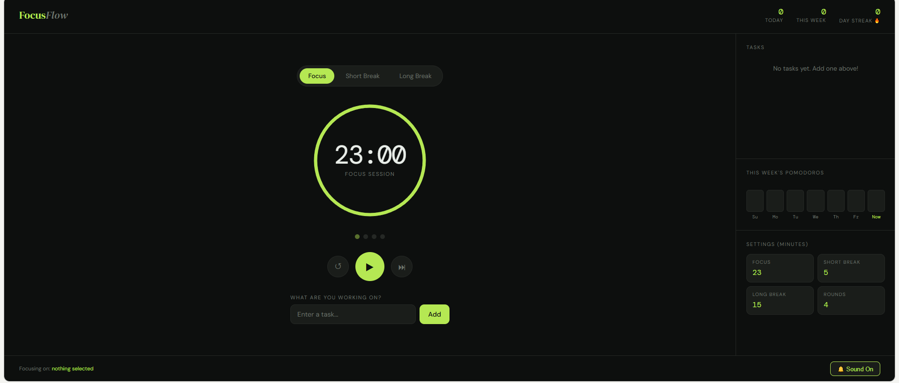

## 🍅 Pomodoro Timer

A simple Pomodoro Timer web application built using HTML, CSS, and JavaScript. This project helps users manage their study or work sessions using the Pomodoro Technique, a popular time-management method that alternates focused work periods with short breaks.

## Features

- ⏱️ Start, pause, and reset timer
- 🎯 Real-time countdown display
- 📱 Responsive and user-friendly interface
- ⚡ Built with pure JavaScript (no frameworks)
- 🎨 Clean and minimal design

## screenshot

## Technologies Used

- HTML5
- CSS3
- JavaScript (ES6)

## Project Structure

Pomodoro-Timer/
│
├── index.html
├── style.css
└── script.js

## How to Run

1. Download or clone the repository.
2. Open "index.html" in your browser.
3. Start the timer and begin your focus session.

## What I Learned

Through this project, I practiced:

- DOM Manipulation
- JavaScript Timer Functions
- Event Handling
- Responsive Web Design
- Front-End Project Structure

## Future Enhancements

- Custom timer durations
   Dark mode enable
- Task management
- Session history tracking

Author

Maitry
